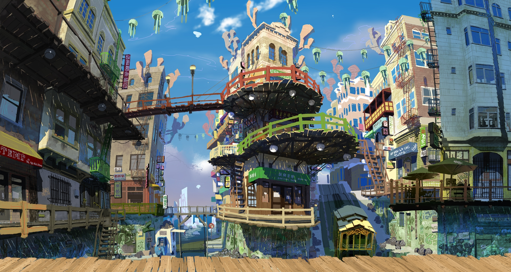

<h1 align="center">Hi 👋, I'm Victor</h1>
<h3 align="center"><b>Can you solve any mathematical problem to any level of accuracy, Neural networks can?<b></h3>

- 🔭 I’m currently working on [Natural Language Processing Ensembles](https://github.com/victorbahlangene/NLP-Disaster-Tweets-kaggle-comp)

- 🌱 I’m currently learning **Fastai, Pytorch, Transformers**

- 👨‍💻 All of my projects are available at [https://victorbahlangene.github.io/Data_Science_Portfolio/](https://victorbahlangene.github.io/Data_Science_Portfolio/)

- 📝 I regularly write articles on [https://medium.com/@victorbahlangene96](https://medium.com/@victorbahlangene96)

- 💬 Ask me about **Pytorch, Fastai**

- 📫 How to reach me **victorbahlangene@outlook.com**

#

### Blogs posts

<!-- BLOG-POST-LIST:START -->

- [Natural_Language_Processing_with_Disaster_Tweets_Part_1](https://medium.com/@victorbahlangene96/natural-language-processing-with-disaster-tweets-part-1-910b61690b9a?source=rss-f688e584b697------2)
- [Sign Language Image Classification part 3_1](https://medium.com/@victorbahlangene96/sign-language-image-classification-part-3-1-a1e6978407e8?source=rss-f688e584b697------2)
- [Kaggle Vision Competition Project - Part 2](https://medium.com/@victorbahlangene96/kaggle-vision-competition-project-part-2-4b5023ffb3cb?source=rss-f688e584b697------2)
- [Kaggle Vision Competition Project - Part 1](https://medium.com/@victorbahlangene96/kaggle-vision-competition-project-part-1-1e1e7a9934f2?source=rss-f688e584b697------2)
- [NLP Transformers Project](https://medium.com/@victorbahlangene96/nlp-transformers-project-827f97476efa?source=rss-f688e584b697------2)
<!-- BLOG-POST-LIST:END -->

#

<h3 align="left">Connect with me:</h3>

#

<h3 align="left">Languages and Tools:</h3>

                 

#

&nbsp;

